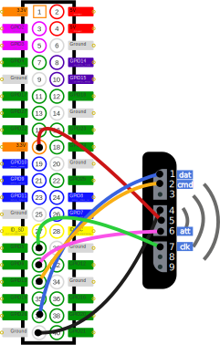

# Demo for Raspberry Pi
**This project has only been tested on a Raspberry PI 3B+**
- [PS controller DualShock2](https://en.wikipedia.org/wiki/DualShock)

## Demo for library
- [emdl-ps2device](https://github.com/esedev/emdl-ps2device)

### Device connection diagram

#### Known Issues
- To successfully connect the gamepad, you need to turn off and turn on the Arduino, then turn on the gamepad.
